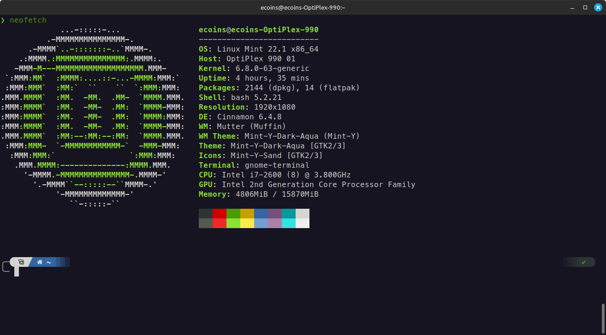
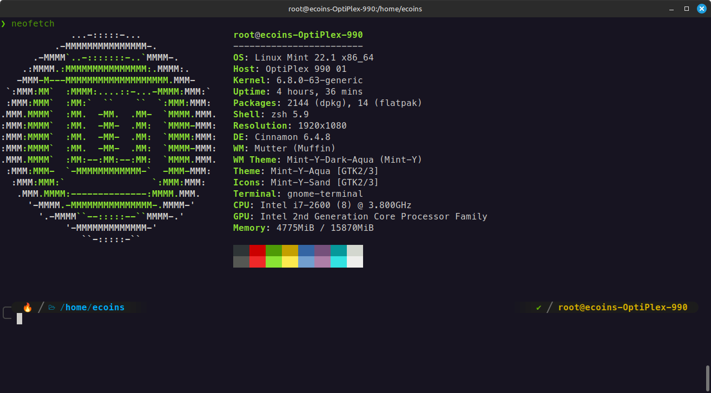

# Configuarion de zsh + powelevel10k 
Mi Configurancion de zsh (ohmyzsh)

la instalacion esta con powerlevel10k con los MesloLGS NF (Nerd Fronts) para la configuracion 

hay alias para los nombre por ejemplo "ls" tira de "lsd" para verse mas bonito al ojo
hay otros como "bat" o "batcat" para referirse a comandos como "cat" 

requisitos:
Terminal - (Como GNOME-Termnal) OJO en Xterm da problemas lo cual no es recomendable hacer este proceso en xterm
zsh - (ohmyzsh) recomendado
powerlevel10k - "p10k.zsh"
batcat - cambiado por "cat"
lsd - cambiado por "ls" o comandos similares

se recomienda root (o superusuario para instalar los archivos de configuracion tanto en root como en el usuario normal)

Pasos a seguir:

1) actualizar el sistema

<pre>sudo apt update && sudo apt upgrade -y</pre>

2) primero instalar zsh

<pre>sudo apt install zsh</pre>

4) despues configurarla como predeterminada (puedes hacerlo desde terminal como por configuraciones de terminal)
por comando 
<pre>chsh -s $(which zsh)</pre>

por configurariones = Preferencias > Comando > ejecutar comando al iniciar pones "zsh" y guarda o cierras las preferencias deberia iniciar desde zsh

4) instalar los MesloLGS NF para esto hay estos 4 tipos de letra (se recomienda instalarlos todos)

[MesloLGS NF Regular](https://github.com/romkatv/powerlevel10k-media/raw/master/MesloLGS%20NF%20Regular.ttf)
[MesloLGS NF Bold](https://github.com/romkatv/powerlevel10k-media/raw/master/MesloLGS%20NF%20Bold.ttf)
[MesloLGS NF Italic](https://github.com/romkatv/powerlevel10k-media/raw/master/MesloLGS%20NF%20Italic.ttf)
[MesloLGS NF Bold Italic](https://github.com/romkatv/powerlevel10k-media/raw/master/MesloLGS%20NF%20Bold%20Italic.ttf)

luego en la terminal puedes configuralos con los siguientes comandos

primero crea una carpeta en tu usuario local (no importa si haces otra en root, esta misma se comparte con todos los usuarios)

<pre>mkdir -p ~/.local/share/fonts</pre>

accedemos a ella

<pre>cd ~/.local/share/fonts</pre>

nos copiamos los archivos en esta carpeta

<pre>cp /donde/esten/los/archivos_de_las_fuentes ~/.local/share/fonts</pre>

luego actualizamos las fuentes

<pre>fc-cache -fv </pre>

vamos a configurarlas en terminal 
primero veamos el perfil actual de la terminal

<pre>PROFILE_ID=$(gsettings get org.gnome.Terminal.ProfilesList default | tr -d "'") echo $PROFILE_ID</pre>

deberia aparecer algo como 

b1dcc9dd-5262-4d8d-a863-c897e6d979b9 (segun tu terminal es diferente)

luego la configuraremos y reiniciamos la terminal

<pre>gsettings set org.gnome.Terminal.Legacy.Profile:/org/gnome/terminal/legacy/profiles:/:$PROFILE_ID/ use-system-font false</pre>

<pre>gsettings set org.gnome.Terminal.Legacy.Profile:/org/gnome/terminal/legacy/profiles:/:$PROFILE_ID/ font 'MesloLGS NF Regular 12'</pre>

cierra la terminal 

cuando la abras denuevo pon esto en la terminal 

<pre>echo -e "\uE0B0 \uE0B1 \uF0FC \uF119 \uF120</pre>

deberian aparcer iconos si estan y aparecen vamos por buen camino 
 
5) instalar ohmyzsh
<pre>sh -c "$(curl -fsSL https://raw.githubusercontent.com/ohmyzsh/ohmyzsh/master/tools/install.sh)"</pre>

OPCIONAL = si te pide configurar como predeterminado configuralo o no segun tus preferencias

6) instalar powerlevel10k 
<pre>git clone --depth=1 https://github.com/romkatv/powerlevel10k.git "${ZSH_CUSTOM:-$HOME/.oh-my-zsh/custom}/themes/powerlevel10k"</pre> 

OJO has control + c para canselar el proceso ya que utilizaremos son archivos de configuracion

7) instalar plugins (sudo, git, zsh-autosuggestions, zsh-syntax-highlighting) 

instalamos zsh-autosuggestions

<pre>git clone https://github.com/zsh-users/zsh-autosuggestions ${ZSH_CUSTOM:-~/.oh-my-zsh/custom}/plugins/zsh-autosuggestions</pre>

instalamos zsh-syntax-highlighting

<pre>git clone https://github.com/zsh-users/zsh-syntax-highlighting.git ${ZSH_CUSTOM:-~/.oh-my-zsh/custom}/plugins/zsh-syntax-highlighting</pre>

ya esta listo

8) copiamos los archivos en sus directorios de la .p10k.zsh (recuerda antes que se pongan en los directorios correspondientes de cada usuario cambia p10k.zsh_root a .p10k.zsh en el directorio de root, igual con los usuarios
cambia p10k.zsh_usuario a .p10k.zsh en el diretorio del usuario)

9) copiamos los archivos en sus directorios de la .zshrc (recuerda antes que se pongan en los directorios correspondientes de cada usuario cambia zshrc_root a .zshrc en el directorio de root, igual con los usuarios
cambia zshrc_usuario a .zshrc en el diretorio del usuario)

10) OPCIONAL cambiar el fondo de la terminal yo recomiendo el tema en preferencias en colores dentro de el apartado de temas usar el estilo "GNOME oscuro"

Listo ya esta tu entorno de terminal en linux mint

Usuario Root!!!

Espero te guste 
